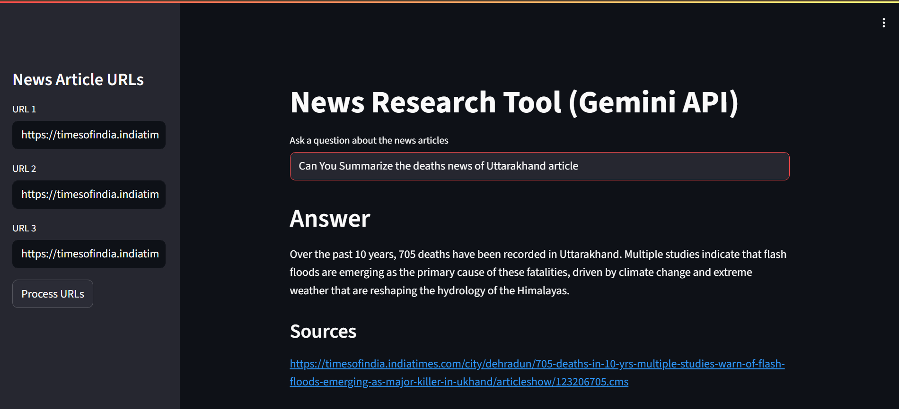
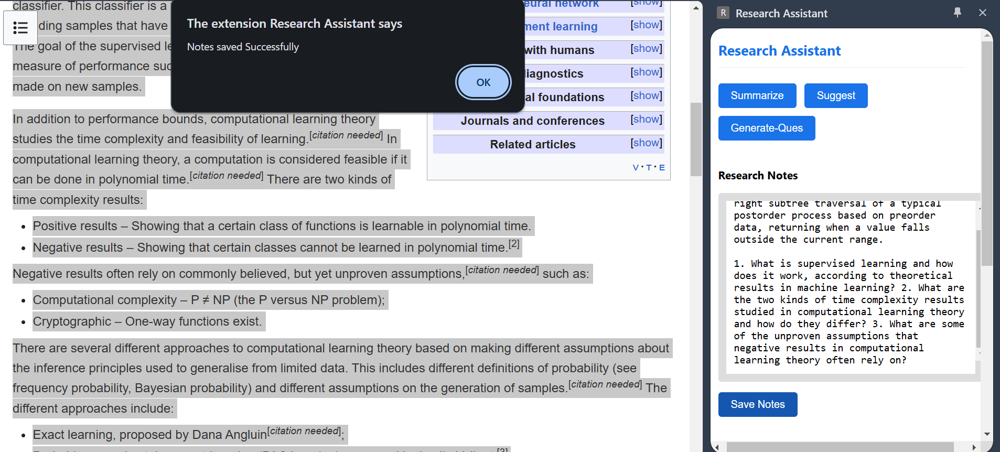
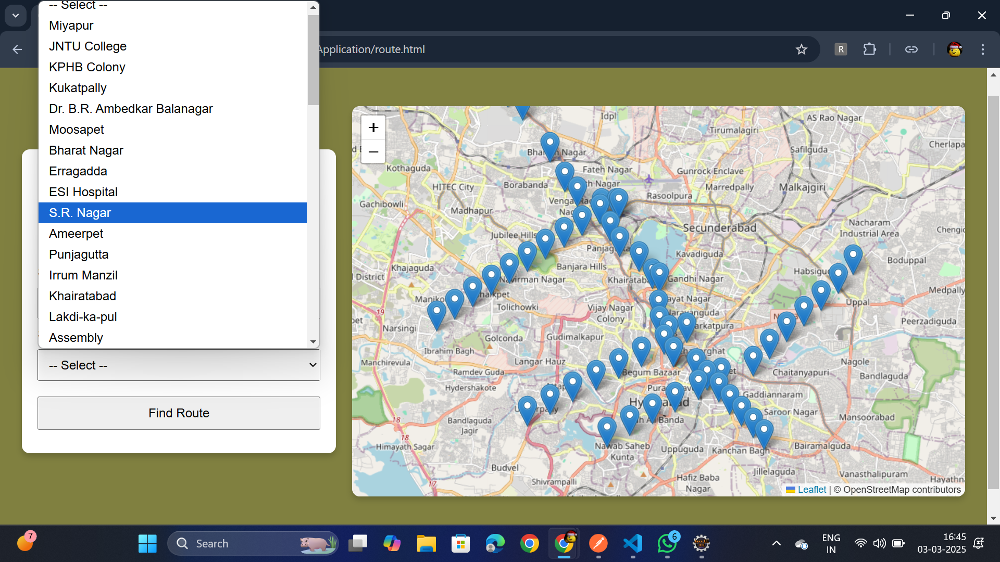

### A little about me...   
I'm a **Computer Science Graduate 🎓 and a Tech Enthusiast 💻 😃** passionate about learning and working with new tech. I love building interesting and amazing products that serve a great deal of purpose.

And I’m someone who enjoys learning by building and improving over time, drawing knowledge from various resources such as YouTube, blogs, articles, and more. The projects here reflect an end-to-end exploration of ideas — from understanding concepts and designing solutions to implementing them with care.

**`Learning | Building | Improving`** 

### 📬 Find me at
 

---

<table width="100%" cellpadding="16" cellspacing="0" style="border-collapse: collapse; border: 1px solid #30363d; border-radius: 8px; overflow: hidden;">
  <tr>
    <td valign="top" width="50%" style="border-right: 1px solid #30363d; background-color: #0d1117;">

### 🌱 Currently

- Exploring Agentic AI Workflows using LangGraph
- Focusing on Building RAG based Systems 
- Continuously improving on RELTIO MDM
- Improving Programming Skills too.
- Aim is to grow both Technically and Personally. 

    </td>
    <td valign="top" width="50%" style="background-color: #0d1117;">

### 🧠 Interests (Beyond Work)

- Reading and learning from different perspectives  
- Appreciating good food more than I usually do  
- Music as a constant background companion  
- Minimalist thinking — in life and decisions  
- Writing and journaling to organize thoughts 

    </td>
  </tr>
</table>

---

## Skill stack
<!-- Skill icons provided by skill-icons. Full icon list and names:
     https://github.com/tandpfun/skill-icons?tab=readme-ov-file#icons-list -->

**Also comfortable with**: SQL (Oracle SQL & PLSQL), RELTIO MDM , Basic ML workflows.
<!-- **Also Currently Learning**:  -->
---
## Projects - showcase

<table>
  <tr>
    <td align="center" width="33%">
      
       
      <b>RAG AI Chatbot</b> 
      Retrieve and answer's the questions from news articles using Retrieval-Augmented Generation. 
      🔗 <a href="https://github.com/sureshmrd/rag_chatbot">Repo</a>
       
      Tags: AI, LLMs, RAG, Gemini API 
    </td>
    <td align="center" width="33%">
      
       
      <b>Research-Assistant</b> 
      A Research Assistant web extension built using Spring Boot (with Lombok) and Gemini API to help users conduct research efficiently. 
      🔗 <a href="https://github.com/sureshmrd/Research-Assistant.git">Repo</a>
       
      Tags: Springboot,Gemini API, Chrome Extension
    </td>
    <td align="center" width="33%">
      
       
      <b>Hyderabad Metro Simulation</b> 
      web-based project that provides with metro-related information, like station details and the shortest route between two selected stations. 
      🔗 <a href="https://github.com/sureshmrd/Hyderabad-Metro-System-Application.git">Repo</a>
       
      Tags: Java, JSP, Oracle, Dijkstras, Leaflet.js
    </td>
  </tr>
</table>

### 🚀 Quick Stats

<!--  -->

## ✨ Fun Fact

I enjoy keeping things simple — except when I’m explaining why they should be simple.
